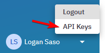

# Cone

Cone is an open-source utility that provides common user workflows from ConductorOne on the command line.

## Installation

### From Source

To install Cone from source, follow these steps:

1. Clone the repository:

   ```shell
   $ git clone https://github.com/conductorone/cone.git
   ```

2. Build the binary:

   ```shell
   $ make build
   ```

   This will create a `cone` binary in the `dist/{your_platform}` directory.

   Example:
   ```shell
   $ make build
   go build -o dist/windows_amd64/cone.exe ./cmd/cone
   ```

### Homebrew

Cone is also available via Homebrew. You can install it by running:

```shell
$ brew install conductorone/cone/cone
```

## Getting Started

To get started with Cone, you need to first create an API key in ConductorOne:

1. Log in to ConductorOne.
2. Once logged in, click the user profile in the bottom left corner of the page. From this menu, select `API Keys`.

   

3. Create an API Credential.

   

4. Copy the values for the `Client ID` and `Client Secret` and put them in a `config.yaml` file. This `config.yaml` can reside in the same directory as Cone or in `$HOME/.conductorone/config.yaml`.

   Example `config.yaml`:

   ```yaml
   profiles:
       default:
           client-id: lovely-vampire-20397@c1dev.logan.dev.ductone.com/pcc
           client-secret: secret-token:conductorone.com:v1:eyJrdHkiOiJPS1AiLCJjcnYiOiJFZDI1NTE5IiwieCI6IkVjX3hZWlJ1V3JjQk0wN05lMXY3dEkyRDNoX3dFWmhFWHNvUzluMjh3djQiLCJkIjoiRjZLWGFNSE9idWNqOUJDdjJlRVJyaTJLNkVxbHNmS19Oa2dzdHNxd3FFUSJ9
   ```

   Alternatively, you can set the `CONE_CLIENT_ID` and `CONE_CLIENT_SECRET` environment variables.

Once authenticated, you can start using Cone to perform various tasks and workflows within ConductorOne.

## Usage

Cone provides the following commands:

```shell
cone is... a cone

Usage:
  cone [command]

Available Commands:
  completion  Generate the autocompletion script for the specified shell
  drop        Create a revoke access ticket for an entitlement by slug
  get         Create an access request for an entitlement by slug
  get-user    Get information about a user
  help        Help about any command
  search      Search for entitlements by name or alias
  whoami      Get information about your current user

Flags:
      --client-id string       Client ID
      --client-secret string   Client secret
      --config-path string     path to config file
      --debug                  Enable debug logging
  -h, --help                   help for cone
  -i, --non-interactive        Disable prompts.
  -o, --output string          Output format. Valid values: table, json, json-pretty. (default "table")
  -p, --profile string         The config profile to use. (default "default")
  -v, --version                version for cone

Use "cone [command] --help" for more information about a command.
```