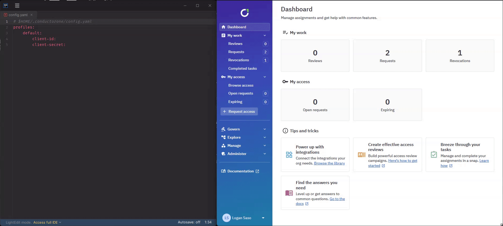

# Cone: The ConductorOne Command Line Tool

Welcome to `cone` – a robust command-line tool from ConductorOne! Written in Go, `cone` is designed to streamline the use-case-specific tasks for developers, security teams, and other end users. `cone` is open source, under the [Aapche 2.0 license](./LICENSE).

# Getting Started

## Installation

Getting `cone` on your system is straightforward. You can choose one of the following two methods:

- [Download from GitHub releases](https://github.com/ConductorOne/cone/releases)

- Install via [Homebrew](https://brew.sh/): If you have Homebrew installed on your system, you can use the following command to install `cone`:

```shell
$ brew install conductorone/cone/cone
```

ConductorOne provides `cone` binaries for popular operating systems including macOS, Windows, and Linux on the x86 and ARM platforms. If your platform is not listed, please [contact us](mailto:support@conductorone.com) or build from source.

## Acquiring a ConductorOne API Key

> **Note:** API Key access to ConductorOne is currently in Early Access. To use `Cone`, a feature flag must be enabled for your tenant. Please contact your ConductorOne representative for more information.

To allow `cone` to interact with ConductorOne on your behalf, you need to generate your `client-id` and `client-secret` via the ConductorOne web application. The following steps guide you:

1. **Log in to the ConductorOne Web Application**: Open your web browser and navigate to the ConductorOne Web Application.
2. **Access the API Keys section**: Once logged in, click on your user profile arrow. Select "API Keys" from the dropdown menu.
3. **Create a new API Key**: Click on the "Create credential" button in the API Keys section. Provide a distinctive and easily identifiable name for your new API Key.
4. **Generate your client-id and client-secret**: After naming your API Key, click "Create". The system will generate your `client-id` and `client-secret`. _The `client-secret` is only visible once. Ensure to copy it and store it securely._
5. **Copy your client-id and client-secret into the Cone configuration file**: Paste the `client-id` and `client-secret` into the Cone configuration file located at `$HOME/.conductorone/config.yaml`, under the default profile:




Here's a Cone configuration file template. Replace `<Your-Client-ID-Goes-Here>` and `<Your-Client-Secret-Goes-Here>` with the actual `client-id` and `client-secret` values:

```yaml
profiles:
  default:
    client-id: <Your-Client-ID-Goes-Here>
    client-secret: <Your-Client-Secret-Goes-Here>
```

> **Note:** We plan to implement a `cone login` command in future `cone` versions to further simplify this process.

# Leveraging `cone`

`cone` provides a range of functionality aimed at simplifying specific tasks for end-users. Here are a few examples of how to use the cone command with different arguments:

## Searching for Available Entitlements

The `search` command displays all entitlements currently available to the user in their Request Catalog:

```shell
$ cone search
```

## Obtaining an Entitlement
The get command retrieves a specific entitlement using its alias:
```shell
$ cone get ${entitlement_alias}
```

For example:
```shell
$ cone get aws-prod-admin
```

This command will find an entitlement in ConductorOne with the alias `aws-prod-admin`. If the user already has access to this entitlement, `cone` will exit successfully (exit status 0). However, if the user doesn't currently have access but the entitlement is available in their Request Catalog, `cone` will create an Access Request task in ConductorOne and notify the necessary approvers.

Once the request is approved, the user will be able to access the entitlement. The command may prompt the user for a justification or length of access, in case of a temporary elevation request.

## Dropping an Entitlement

The `drop` command revokes a specific entitlement using its alias:

```shell
$ cone drop ${entitlement_alias}
```

For example:
```shell
$ cone drop aws-prod-admin
```

If the user currently has this entitlement, `cone` will create a Revoke Task in the ConductorOne platform and de-provision their access. If the user does not have the entitlement, `cone` will exit successfully (exit status 0).


# Configuration File Reference

Cone uses a configuration file located at `$HOME/.conductorone/config.yaml` to store and access user-specific data. This file is in YAML format and is primarily used for storing profile details.

Here's an example configuration file:
```yaml
profiles:
  default:
    client-id: <Your-Client-ID-Goes-Here>
    client-secret: <Your-Client-Secret-Goes-Here>
```

You can add multiple profiles by adding another key to the profiles map, and `cone` will use this profile when the `$CONE_PROFILE` environment variable or `--profile` command line flag are passed to the tool.

## Profile Configuration

- `client-id`: The client-id for the user's API Key.  The client ID has a form of `<random-id>@<tenant>.conductor.one/pcc`.

- `client-secret`: The client-secret for the user's API Key.  This will begin with the string  `secret-token:conductorone.com:v1:...`.

# Contributing, Support, and Issues

We value your contributions and ideas, no matter how small. We aim to make `cone` a fantastic tool for everyone. If you encounter any issues, require support, or have suggestions, please open a Github Issue!

Check out our [CONTRIBUTING.md](https://github.com/ConductorOne/baton/blob/main/CONTRIBUTING.md) for more information.

# License

`cone` is licensed under the [Apache 2.0 license](./LICENSE).

# Contact

For further information or assistance, feel free to contact us at [support@conductorone.com](mailto:support@conductorone.com).

## Reporting Security Issues

At ConductorOne, we prioritize security and take potential issues seriously. If you discover a security issue, please alert us as quickly as possible!

To protect our users, **DO NOT** create a public issue or pull request. Instead, send your report privately to the ConductorOne Security Team at [security@conductorone.com](mailto:security@conductorone.com).

We greatly appreciate security reports, and we will publicly acknowledge your contribution once the issue has been resolved and poses no risk to users. Thank you for helping us ensure the security and integrity of `cone`!
